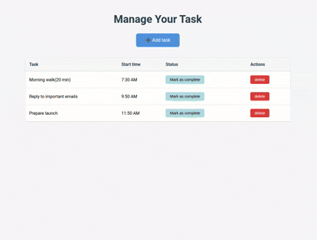

# 📝 Daily Task Manager

A simple daily task management tool built with **HTML**, **CSS**, and **Vanilla JavaScript**. This tutorial project is designed for **absolute beginners**.



> ⚠️ **Note:** For simplicity, this project uses **in-memory storage** (arrays) instead of a database. This means all data is lost when the server restarts. This is intentional for learning purposes - it keeps the project simple and focused on core concepts without database complexity.

## 🎯 Why This Project?

When starting web development, it's better to build simple web apps with base technologies first, instead of jumping directly to frameworks. Understanding how to handle things **without frameworks** is interesting and useful at the beginning. This project teaches you:

- How to build a full-stack application from scratch(Here i don't use database for simplicity, just use array to store data)
- Frontend-backend communication using plain JavaScript
- Basic CRUD operations
- Express.js fundamentals
- Middleware concepts

---

## 📚 Prerequisites

Before going through the code, having a basic understanding of the following will help:

- **HTML** - Structure of web pages
- **CSS** - Styling web pages
- **JavaScript** - Programming logic
- **DOM** - Document Object Model
- **DOM Manipulation** - How to manipulate DOM with JavaScript

### 📖 Learning Resources

If you're not familiar with these concepts, here are some helpful links:

- [MDN Web Docs - HTML](https://developer.mozilla.org/en-US/docs/Web/HTML)
- [W3 schools - HTML](https://www.w3schools.com/html/default.asp)
- [MDN Web Docs - CSS](https://developer.mozilla.org/en-US/docs/Web/CSS)
- [W3 schools - CSS](https://www.w3schools.com/css/default.asp)
- [MDN Web Docs - JavaScript](https://developer.mozilla.org/en-US/docs/Web/JavaScript)
- [W3 schools - JavaScript](https://www.w3schools.com/js/default.asp)
- [MDN Web Docs - DOM](https://developer.mozilla.org/en-US/docs/Web/API/Document_Object_Model)
- [JavaScript.info - DOM Manipulation](https://javascript.info/dom-nodes)
- [Event bubbling](https://developer.mozilla.org/en-US/docs/Learn_web_development/Core/Scripting/Event_bubbling)
- [Evnet-delegation](https://www.greatfrontend.com/questions/quiz/explain-event-delegation)
- [Express.js](https://expressjs.com/)
- [cors](https://expressjs.com/en/resources/middleware/cors.html)
- [middlewares](https://expressjs.com/en/guide/using-middleware.html)

> 💡 **Tip:** Understanding the basics first will give you less frustration when going through the code!

---

## 🏗️ Project Structure

```
daily-task-manager-vanilla-js/
├── frontend/          # Frontend code (HTML, CSS, JavaScript)
│   ├── css/
│   │   └── style.css
│   ├── js/
│   │   ├── script.js
│   │   └── util.js
│   └── index.html
├── backend/           # Backend code (Node.js, Express)
│   ├── app.js         # Main server file
│   ├── util.js        # Middleware and utility functions
│   ├── package.json
│   └── ERROR_HANDLER_SCENARIOS.md
└── README.md
```

---

## 🎨 Frontend

The frontend is built with:

- **HTML** - Structure
- **CSS** - Styling (minimal, beginner-friendly)
- **Vanilla JavaScript** - Functionality

### Key Features:

- ✅ Add new tasks with time
- ✅ View all tasks in a table
- ✅ Mark tasks as complete/incomplete
- ✅ Delete tasks
- ✅ Tasks sorted by completion status
- ✅ Time displayed in 12-hour format (AM/PM)

### Technologies Used:

- **Fetch API** - For connecting with the backend (built-in JavaScript, no libraries needed!)

---

## ⚙️ Backend

The backend is built with:

- **Node.js** - JavaScript runtime
- **Express.js** - Web framework

### What You'll Learn:

- ✅ Basic CRUD operations (Create, Read, Update, Delete)
- ✅ How to use CORS (Cross-Origin Resource Sharing)
- ✅ What is middleware and how to use it at beginner level
- ✅ Error handling with try-catch
- ✅ Request validation
- ✅ RESTful API design

### API Endpoints:

| Method | Endpoint     | Description                                 |
| ------ | ------------ | ------------------------------------------- |
| GET    | `/tasks`     | Get all tasks (sorted by completion status) |
| POST   | `/tasks`     | Create a new task                           |
| PATCH  | `/tasks`     | Update task completion status               |
| DELETE | `/tasks/:id` | Delete a task by ID                         |

---

## 🚀 Getting Started

### Step 1: Clone the Repository

```bash
git clone <repo-url>
```

### Step 2: Install Node.js

Make sure you have **Node.js** installed on your system.

- Download from: [nodejs.org](https://nodejs.org/)
- Verify installation:
  ```bash
  node --version
  npm --version
  ```

### Step 3: Setup Backend

1. Navigate to the backend folder:

   ```bash
   cd backend
   ```

2. Install dependencies:

   ```bash
   npm install
   ```

3. Start the server:

   ```bash
   node app.js
   ```

   You should see:

   ```
   Example app listening on port 3000
   ```

   The backend server is now running on `http://127.0.0.1:3000`

### Step 4: Setup Frontend

1. Navigate to the frontend folder (in a new terminal):

   ```bash
   cd frontend
   ```

2. **Option A: Using VS Code Live Server (Recommended)**

   - Install the [Live Server extension](https://marketplace.visualstudio.com/items?itemName=ritwickdey.LiveServer) in VS Code
   - Right-click on `index.html`
   - Select "Open with Live Server"

3. **Option B: Open Directly in Browser**
   - Simply open `index.html` with your browser

### Step 5: Run the Application

1. Make sure the backend server is running (Step 3)
2. Open the frontend in your browser (Step 4)
3. Start adding and managing your tasks! 🎉

---

## 🧪 Testing the Application

### Test Error Handler

To see how error handling works, try these test endpoints:

1. **Test Error Handler:**

   ```
   GET http://127.0.0.1:3000/test-error
   ```

2. **Test Unhandled Error:**

   ```
   GET http://127.0.0.1:3000/test-error-2
   ```

3. **Test 404 Handler:**
   ```
   GET http://127.0.0.1:3000/non-existent-route
   ```

> 💡 **Tip:** You can use [Postman](https://www.postman.com/) or your browser to test these endpoints!

---

## 🎓 Learning Path

1. **Start with Frontend:**

   - Open `frontend/index.html` and understand the structure
   - Check `frontend/js/script.js` to see how JavaScript interacts with the DOM
   - Understand how the Fetch API connects to the backend

2. **Then Explore Backend:**

   - Open `backend/app.js` to see the server setup
   - Check `backend/util.js` to understand middleware
   - Read `backend/ERROR_HANDLER_SCENARIOS.md` for error handling examples

3. **Experiment:**
   - Add new features
   - Modify existing code
   - Remove code to see what breaks
   - Add your own styling
   - Try different API endpoints

---

## 📝 Code Structure

### Frontend Files:

- **`index.html`** - Main HTML structure with comments explaining each section
- **`css/style.css`** - Minimal, beginner-friendly CSS with detailed comments
- **`js/script.js`** - JavaScript code with comments explaining:
  - Event listeners
  - Fetch API calls
  - DOM manipulation
  - Time formatting

### Backend Files:

- **`app.js`** - Main server file with:

  - Server setup
  - Route handlers (GET, POST, PATCH, DELETE)
  - Error handling

- **`util.js`** - Utility functions and middleware:
  - Authentication middleware (placeholder)
  - Form validation middleware
  - Error handler
  - 404 handler

---

## 🐛 Troubleshooting

### Backend Issues:

- **Port already in use:**

  - Change the port in `backend/app.js` (line 30)
  - Or stop the process using port 3000

- **Module not found:**
  - Make sure you ran `npm install` in the backend folder

### Frontend Issues:

- **CORS errors:**

  - Make sure the backend server is running
  - Check that CORS is enabled in `backend/app.js`

- **Tasks not loading:**
  - Check browser console for errors
  - Verify backend is running on port 3000
  - Check network tab in browser DevTools

---

## 🎯 Next Steps

After completing this project, you can:

1. ✅ Add user authentication
2. ✅ Add task categories/tags
3. ✅ Add due dates
4. ✅ Add task descriptions
5. ✅ Add database (MongoDB, PostgreSQL)
6. ✅ Add task search functionality
7. ✅ Add task filtering
8. ✅ Deploy to a hosting service

---

## 🤝 Contributing

This is a tutorial project for beginners. Feel free to:

- Fork the repository
- Make improvements
- Add new features
- Share with others learning web development

---

## 📧 Support

If you have questions or get stuck:

1. Check the code comments - they explain everything in detail
2. Read the error messages carefully
3. Check browser console for frontend errors
4. Check terminal/console for backend errors

---

## 🎉 Happy Learning!

Remember: **Practice makes perfect!** Don't be afraid to experiment, break things, and learn from your mistakes. That's how you become a better developer!

**Good luck with your web development journey! 🚀**
